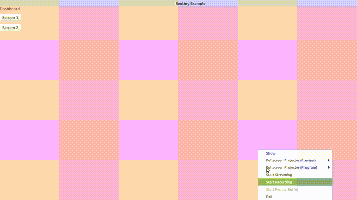

## JavaFx Routing: Elegant Navigation for JavaFX Applications

---

[](https://jitpack.io/com/github/rahulstech/javafx-routing/1.0.0/javadoc/)
[](https://jitpack.io/#rahulstech/javafx-routing)
[](https://opensource.org/licenses/MIT)

**javafx-routing** is an open-source library designed to simplify and enhance navigation within your JavaFX applications. It provides a user-friendly and flexible approach to switching between different screens with smooth animations and seamless integration with existing development practices.

**Requirments:**  
Minimum requirements to run `javafx-routing` are
- jdk 11 or later
- openjavafx 11 or later

**Key Features:**

* **Powerful Abstraction:** The library's abstraction layer empowers you to use your own preferred methods and frameworks for specific tasks while seamlessly integrating them into the routing process. This abstraction covers layout controller creation, animation creation, and screen transitions.
* **Destination-Based Design:** Each screen in your application is considered a [`Destination`](./library/src/main/java/rahulstech/jfx/routing/element/Destination.java), providing a clear structure for navigation management.
  `Destination` is the information how the screen will be created rather than actual screen state.
* **Elegant Navigation:** Switch between views with ease using clear routing mechanisms and beautiful animations.
* **Single Scene Navigation:** Manage your application within a single scene, improving memory efficiency and visual flow.
* **Animation Abstraction:** Create custom animations using your preferred library while maintaining a consistent routing experience.
* **Backstack Management:** Keep track of previously visited views for efficient back navigation without losing application state.
* **Lifecycle Events:** Hook into dedicated lifecycle methods (create, initialize, start, hide, destroy) in your controllers.
    - Gain control over processing based on view visibility (foreground/background).
    - Start tasks like video playback when a view becomes visible and pause them when hidden.
    - Handle resource management (e.g., database connections) efficiently during the `destroy` phase.
* **Flexible Layout and Controller Creation:** Leverage the [`RouterExecutor`](./library/src/main/java/rahulstech/jfx/routing/RouterExecutor.java) to define your layouts and controllers in a way that works best for your project.
* **Transaction Mechanism:** The screen transitions are performed by [`Transaction`](./library/src/main/java/rahulstech/jfx/routing/Transaction.java) abstraction layer. Screen with state is called `Target`.
  `Transaction` stores multiple [`Target`](./library/src/main/java/rahulstech/jfx/routing/Transaction.java)s in its own backstack.
* **Flexible Configuration:** Configure routing effortlessly using a routing configuration XML file or Java code which even suits for you.
* **Type-Safe Argument Passing:** [`RouterArgument`](./library/src/main/java/rahulstech/jfx/routing/element/RouterArgument.java) ensures type-safe argument passing and automatic validation before displaying a screen. It raises exceptions for missing or invalid arguments.
  Also pass result to a previous screen while navigating back to a previous screen.

**Getting Started:**

To use `javafx-routing` just add the following two lines in your `build.gradle`. Check _jitpack_ badge above for the latest version.

```groovy
repositories {
  // other repositories
  maven { url 'https://jitpack.io'}
}

dependencies {
  implementation "com.github.rahulstech:javafx-routing:<latest version>"
}
```

**Benefits:**

* **Improved User Experience:** Provide a more intuitive and visually appealing navigation experience for your users.
* **Simplified Development:** Focus on building your application logic rather than reinventing navigation mechanics.
* **Increased Maintainability:** Create a well-structured and maintainable codebase with clearly defined responsibilities.
* **Better Resource Management:** Optimize resource usage by handling lifecycle events effectively.

**Working Example**

See `javafx-routing` in action! This short animation demonstrates basic navigation using the library:



**More Examples:**

Explore the various functionalities of `javafx-routing` through these detailed examples:

1. [Basic Demo](./samples/basic-demo/ReadMe.md)
2. [Advance Demo](./samples/single-scene-demo/ReadMe.md)
3. [Nested Router Demo](./samples/nested-router-demo/ReadMe.md)
4. [History Demo](./samples/history-demo/ReadMe.md)

**Change Log:**  
Track the changes and features added in each version [here](CHANGELOG.md)

**Contributing:**

We welcome contributions to the `javafx-routing` project! Check the contribution [guideline](./CONTRIBUTING.md).

**License:**

This project is licensed under the `MIT` license. See the [LICENSE](LICENSE.txt) file for more information.

**Happy Routing with javafx-routing!**
